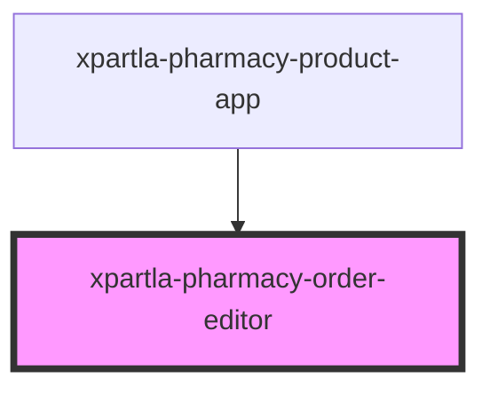

# xpartla-pharmacy-order-editor

<!-- Auto Generated Below -->

## Properties

| Property     | Attribute     | Description | Type                    | Default     |
| ------------ | ------------- | ----------- | ----------------------- | ----------- |
| `apiBase`    | `api-base`    |             | `string`                | `undefined` |
| `orderId`    | `order-id`    |             | `string`                | `undefined` |
| `pharmacyId` | `pharmacy-id` |             | `string`                | `undefined` |
| `userRole`   | `user-role`   |             | `"lekaren" \| "sestra"` | `undefined` |

## Events

| Event                 | Description | Type                  |
| --------------------- | ----------- | --------------------- |
| `order-editor-closed` |             | `CustomEvent<string>` |

## Dependencies

### Used by

 - [xpartla-pharmacy-product-app](../xpartla-pharmacy-product-app)

### Graph

----------------------------------------------

*Built with [StencilJS](https://stenciljs.com/)*
